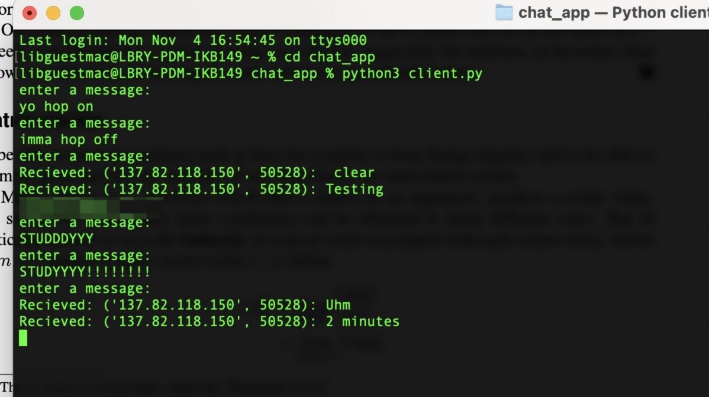

# ubc-ikb-chat

if y'all wanna chat b/w the computers in ikb :p just run `python3 server.py` and paste the ip after running `python3 client.py` wherever u wanna open a chat terminal

wrote this cause i was bored and we just wanted to fk around

if yall wanna play ping pong on the ikb computers go to [ping-pong-online](https://github.com/Shubhaankar-Sharma/ping-pong-online)

the code is like 5 years old when i just started programming, so will need some fixes in the game mechanics its not enjoyable rn
